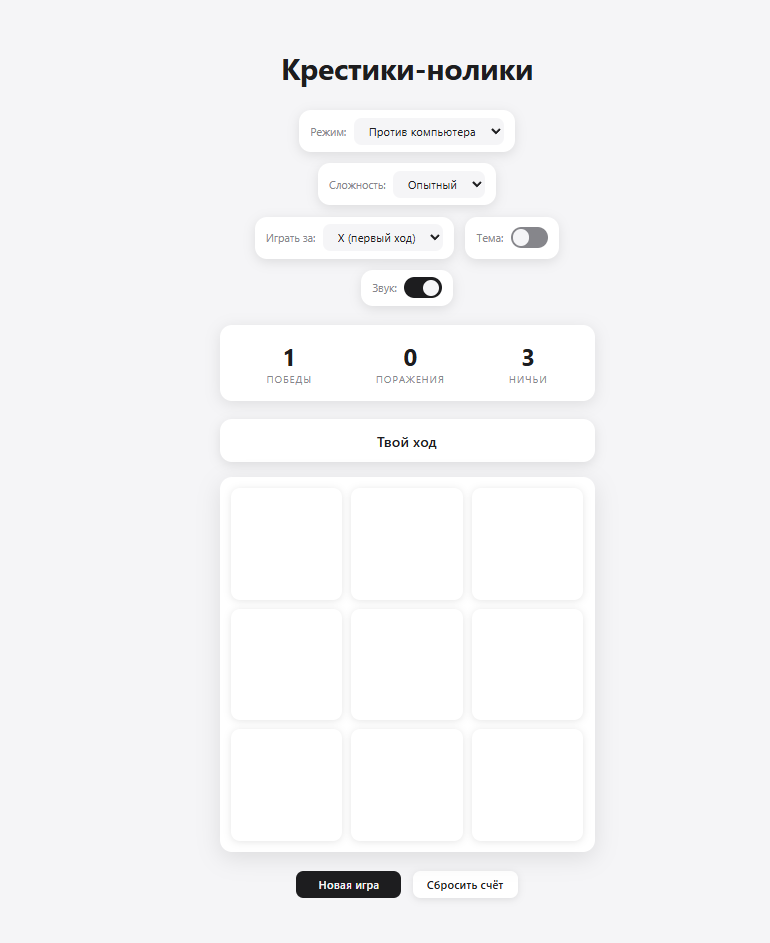

# 🎮 Tic-Tac-Toe: Ultimate Edition

[](https://github.com/maks3592/tic-tac-toe-2135123/blob/main/LICENSE)
[](https://developer.mozilla.org/en-US/docs/Web/JavaScript)
[](https://en.wikipedia.org/wiki/Vanilla_software)

> Современная, красивая и умная версия классической игры «Крестики-нолики». 
> Минималистичный дизайн, плавные анимации, умный ИИ и звуковое сопровождение.



## ✨ Особенности

- 🧠 **3 Уровня сложности ИИ**: от рассеянного «Новичка» до непобедимого «Эксперта» (Minimax + Alpha-Beta).
- 🔊 **Звуковое погружение**: приятные звуки кликов, победы и поражения (Web Audio API).
- 🎉 **Эффекты победы**: праздничное конфетти при вашем выигрыше.
- 📱 **Полная адаптивность**: идеально выглядит на телефоне, планшете и десктопе.
- 💾 **Сохранение прогресса**: статистика побед не пропадёт после перезагрузки.
- ⚡ **Чистый код**: никаких библиотек, только HTML, CSS и Vanilla JS.

## 🚀 Быстрый старт

### Вариант 1: Открыть в браузере
Просто скачайте файл `index.html` и откройте его в любом современном браузере. Установка не требуется!

### Вариант 2: Локальный сервер
```bash
git clone https://github.com/maks3592/tic-tac-toe-2135123.git
cd tic-tac-toe-2135123
# Откройте index.html в браузере или используйте Live Server в VS Code
```

## 🎮 Как играть

1. **Выберите режим**: Игра против компьютера или вдвоём за одним устройством.
2. **Настройте сложность**:
   - 🟢 **Новичок**: ИИ ходит почти случайно, легко упускает победу.
   - 🟡 **Опытный**: Блокирует ваши угрозы, но может ошибиться.
   - 🔴 **Эксперт**: Непобедимый алгоритм Minimax. Сможете свести игру к ничьей?
3. **Выберите символ**: Играйте за Крестик (X) или Нолик (O).
4. **Наслаждайтесь игрой**: Следите за статусом, слушайте звуки и наблюдайте за анимациями.

## 🛠 Технологии

- **HTML5**: Семантическая верстка.
- **CSS3**: Flexbox/Grid, CSS Variables, Animations.
- **JavaScript (ES6+)**: Логика игры, AI (Minimax), Web Audio API, LocalStorage.
- **SVG**: Векторная графика для иконок и анимаций символов.

## 📜 Лицензия

Этот проект распространяется под лицензией MIT. См. файл [LICENSE](LICENSE) для подробностей.

---

<div align="center">
  <p>Сделано с ❤️ и ☕</p>
  <p>
    <a href="#top">Вернуться наверх</a>
  </p>
</div>
